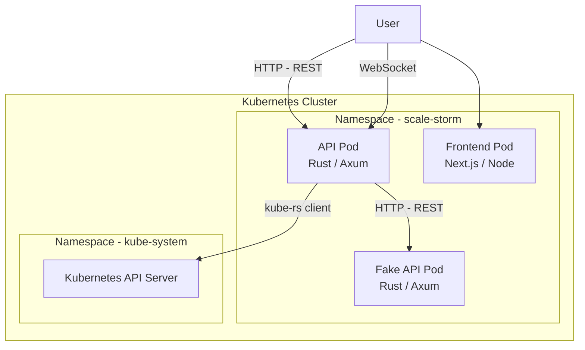

# ScaleStorm

## Architecture

The diagram below represents the deployment architecture of the ScaleStorm application within a Kubernetes cluster. The application consists of several components deployed as pods:

- **Frontend Pod**: a React/Next.js application served by Node.js, providing the user interface.

- **API Pod**: a backend service developed in Rust using the Axum framework, exposing a REST API and WebSockets for processing business requests.

- **Fake API Pod**: a simulation API service developed in Rust/Axum, enabling application testing without real interactions with the cluster.

The **Frontend** allows users to communicate with the main API via REST (`/api/_`) and WebSocket for real-time interactions, as well as with the Fake API for test scenarios (`/fake-api/_`).

The backend services leverage the `kube-rs` library to interact directly with the Kubernetes API server, enabling dynamic management of cluster resources (e.g., retrieving metrics, modifying Kubernetes objects, etc.).

This modular architecture provides great flexibility for the development, testing, and deployment of the application, while fully leveraging the capabilities offered by Kubernetes.

## ScaleStorm Deployment Diagram

## Threat Model

We have chosen to adopt an **isolated thread model** for communications between the different components of the application.

We used **IriusRisk** to generate the threat diagram — and consequently, to identify the potential threats.

### Top 10 Threats

| Source               | Threat                                                              |
| -------------------- | ------------------------------------------------------------------- |
| Bare Metal Server    | Implement strict access controls and activity monitoring            |
| Bare Metal Server    | Implement multi-factor authentication for administrative interfaces |
| Bare Metal Server    | Conduct thorough supply chain risk assessments                      |
| Kubernetes Cluster   | The default namespace should not be used                            |
| Kubernetes Namespace | Limit Service Account privileges and perform regular audits         |
| Kubernetes Namespace | Implement network policies and namespace segmentation               |
| Kubernetes Namespace | Implement RBAC auditing and enforce least privilege                 |
| Kubernetes Namespace | Implement lateral movement detection and prevention mechanisms      |
| Laptop               | Implement regular firmware updates and vulnerability monitoring     |
| Laptop               | Procure components from trusted vendors and verify authenticity     |

_Choise explaine_

The bare metal server is the most critical component of the system with the biggest attack surface that explain why we have choosen to focus on this component.

### Mitigations

#### Bare Metal Server

We are considering the use of a specialized operating system distribution. **Talos Linux** is a strong candidate.
This distribution provides a reduced attack surface and enforces strict access controls.

For monitoring, we will implement a complete monitoring and security solution directly on the Kubernetes nodes.

Regarding multi-factor authentication: with Talos, the issue is effectively eliminated, as there is no shell-based authentication on the bare metal servers.

#### Kubernetes Cluster

We should avoid using the `default` namespace for deploying workloads — instead, we will enforce namespace isolation and lifecycle management, ensuring that namespaces are created and destroyed as needed.

#### Kubernetes Namespace

We are considering switching to a more secure CNI (Container Network Interface) such as **Cilium**.
If switching the CNI is not possible, we will implement strict **NetworkPolicies** to limit communication between namespaces and services.

Additionally, we can integrate authentication with our existing system (e.g. **Okta**), centralizing access control.
This will enable us to enforce fine-grained access to namespaces and other resources through a unified identity management system.

#### Laptop

The inclusion of "Laptop" in the threat model is a mistake — personal laptops are not within the scope of this system's security boundary, as they are not controlled devices in this architecture.

## Continuous Integration / Continuous Deployment

In this project, we are using **GitHub**, this allow us to use the following features:

- **GitHub Actions**: to automate the build, test, and deployment of the application.
- **GitHub Security**: to scan the code for vulnerabilities and security issues.
- **GitHub Code Scanning**: to scan the code for vulnerabilities and security issues.

We have a setup 4 workflows:

- **Security Scan with packages managers**: to scan the code for vulnerabilities and security issues.
- **Scan Gitleaks**: to scan the code for vulnerabilities and security issues.
- **Scan SCA with Snyk**: to scan the code for vulnerabilities and security issues.
- **Scan Docker Image with Trivy**: to scan the code for vulnerabilities and security issues.

### Security Scan with packages managers

Our project is using **pnpm** as package manager for the frontend and **cargo** for the backend.

#### Pnpm

For the frontend packages manager we have the command `pnpm audit` to check for known security issues with installed packages.

As you can see in the result, we have 541 dependencies and 0 vulnerabilities.

#### Cargo

For the backend packages manager we do not have a command to check for known security issues with installed packages.
But some packages from cargo add features to check for known security issues with installed packages.

We have test the following packages:

- **cargo-audit**: to check for known security issues with installed packages.
- **cargo-geiger**: to check for unsafe code in the codebase.

The result from geiger is not very good, it's due to the fact that the scan scan dependencies and sub-dependencies but it's not our job to fix them.
About the cargo-audit, the main threat is about the tokio crate, it's a crate that is used to make the application asynchronous.
To fix this we have to update the tokio crate to a newer version. We have done this in the `Cargo.toml` file and now the scan is clean.

### Scan Gitleaks

Gitleaks is a tool that scans for secrets in the codebase across all commits, branches, and pull requests.

We have a setup a workflow to scan the codebase with Gitleaks.

As you can see in the result, we have 1 secret detected in the codebase.
But it's false positive, the secret is not a true secret, it's a fake secret.

### Scan with Snyk

Snyk is a tool that scans for vulnerabilities in the code and dependencies.

- **Frontend Libs (`snyk_front_libs.json`)**:
  - No known vulnerabilities detected in frontend dependencies.
  - 21 dependencies analyzed.
  - License policy applied (AGPL, GPL, LGPL, etc.).
  - Private and secure project.

- **API Code (`snyk_api_code.json`)**:
  - 1 vulnerability detected:
    - **Type**: Overly permissive CORS
    - **File**: `src/routes.rs` (line 9)
    - **Description**: The CORS policy may allow unauthorized domains to access the API.
    - **Recommendation**: Restrict allowed origins in the CORS configuration.

- **Frontend Code (`snyk_front_code.json`)**:
  - (No critical vulnerability detected, or to be completed depending on the file content.)

**Conclusion**:
The project is overall healthy regarding dependencies. Special attention should be paid to the API's CORS configuration to avoid security risks related to overly permissive origins.

### Scan Docker Image with Trivy

Trivy is a tool that scans for vulnerabilities in the Docker image.

We have set up a workflow to scan the Docker image with Trivy.

The vulnerabilities are directly linked to the codebase and the dependencies.

For the report, we have exported the results.

#### Trivy Scan Results Summary

- **API Docker Image (`docker_api.json`)**:
  - No critical vulnerabilities detected.
  - Base image: Alpine Linux 3.22.0
  - Total size: 226,381,312 bytes (approximately 216 MB)
  - Architecture: arm64
  - Created: 2025-06-06T12:30:37.817861+02:00
  - Security configuration:
    - Runs as non-root user `nextjs` (UID 1001)
    - Group: `nodejs` (GID 1001)
    - Environment: Production mode with `NODE_ENV=production`, `PORT=80`, `HOSTNAME=0.0.0.0`
  - Build process follows security best practices:
    - Uses official Node.js v22.16.0
    - Implements proper user permissions
    - Removes build dependencies
    - Cleans temporary files
    - Uses multi-stage build to minimize final image size

- **Frontend Docker Image (`docker_front.json`)**:
  - No critical vulnerabilities detected.
  - Base image: Alpine Linux 3.22.0
  - Total size: 226,381,312 bytes (approximately 216 MB)
  - Architecture: arm64
  - Created: 2025-06-06T12:30:37.817861+02:00
  - Security configuration:
    - Runs as non-root user `nextjs` (UID 1001)
    - Group: `nodejs` (GID 1001)
    - Environment: Production mode with `NODE_ENV=production`, `PORT=80`, `HOSTNAME=0.0.0.0`
  - Build process follows security best practices:
    - Uses official Node.js v22.16.0
    - Implements proper user permissions
    - Removes build dependencies
    - Cleans temporary files
    - Uses multi-stage build to minimize final image size

**Conclusion**:
The Docker images for both the API and Frontend are well-structured and secure, with no detected vulnerabilities in either the OS packages or Node.js dependencies.
